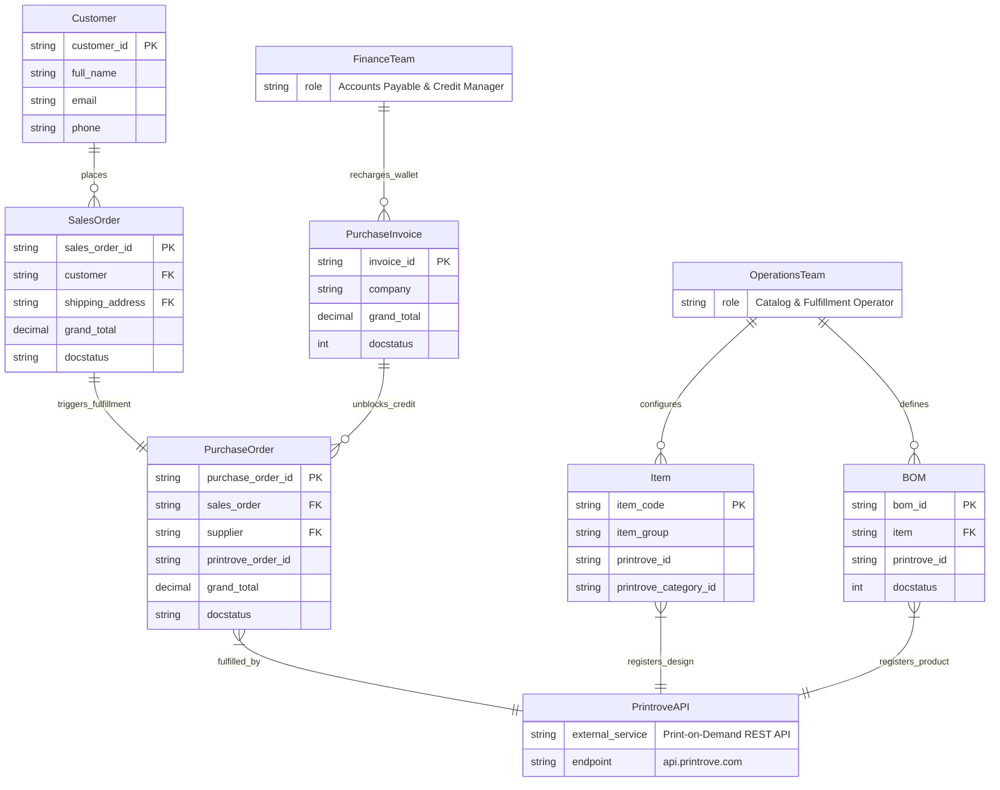

# Context and Scope

## Business Context
`frappe_printrove` integrates ERPNext with Printrove, enabling automated print-on-demand fulfillment. It establishes seamless boundaries between internal retail ordering, product specification, procurement accounting, and external on-demand factory manufacturing.

Link to C1 System Context Model: [C1 System Context Diagram](../c4/01-system-context.md)

### External Domain Context

## Technical Context

| Interface / Channel | Protocol | Payload / Format | Direction | Description |
| :--- | :--- | :--- | :--- | :--- |
| Token API (`/api/external/token`) | HTTPS / POST | JSON (`email`, `password`) | Outbound | Authenticates merchant credentials and receives JWT bearer token. |
| Design API (`/api/external/designs/url`) | HTTPS / POST | JSON ([`DesignUrlRequest`](apps/frappe_printrove/frappe_printrove/schemas/design.py:6)) | Outbound | Submits public artwork image URLs for asynchronous rendering and storage. |
| Product API (`/api/external/products`) | HTTPS / POST | JSON ([`ProductCreateRequest`](apps/frappe_printrove/frappe_printrove/schemas/product.py:16)) | Outbound | Registers custom SKU configurations mapping artwork coordinates to blank garments. |
| Serviceability API (`/api/external/serviceability`) | HTTPS / GET | Query Params ([`ServiceabilityRequest`](apps/frappe_printrove/frappe_printrove/schemas/serviceability.py:4)) | Outbound | Inquires courier feasibility and real-time shipping costs based on pincode and weight. |
| Order API (`/api/external/orders`) | HTTPS / POST | JSON ([`OrderCreateRequest`](apps/frappe_printrove/frappe_printrove/schemas/order.py:19)) | Outbound | Dispatches purchase order, shipping details, and SKU items for production. |
| Redis FastStream Queue | Redis Protocol | FastStream Job Packets | In-Bench | Asynchronous message broker facilitating decoupled job execution. |
| MariaDB ORM Connection | MySQL Protocol | SQL Transactions | In-Bench | Persists transactional documents, custom fields, and execution metadata. |
