# Building Block View

## Whitebox Overall System
This chapter presents the building blocks of `frappe_printrove`, spanning container infrastructure (Level 1) down to internal code components (Level 2).

Link to C2 Container Model: [C2 Container Diagram](../c4/02-container.md)

### Level 1: Container Architecture

```mermaid
erDiagram
    Nginx ||--|| Gunicorn : "HTTP / Reverse Proxy"
    Gunicorn ||--|| MariaDB : "SQL / MariaDB 10.6+"
    Gunicorn ||--|| RedisCache : "TCP / In-Memory Cache"
    Gunicorn ||--o{ RedisQueue : "Pushes Event Tasks"
    FastStreamWorker }|--|| RedisQueue : "Pops Background Tasks"
    FastStreamWorker ||--|| MariaDB : "Reads / Updates DocTypes"
    FastStreamWorker ||--|| RedisCache : "Caches Access Tokens"
    FastStreamWorker }|--|| PrintroveAuthAPI : "POST /api/external/token"
    FastStreamWorker }|--|| PrintroveDesignAPI : "POST /api/external/designs/url"
    FastStreamWorker }|--|| PrintroveProductAPI : "POST /api/external/products"
    FastStreamWorker }|--|| PrintroveServiceabilityAPI : "GET /api/external/serviceability"
    FastStreamWorker }|--|| PrintroveOrderAPI : "POST /api/external/orders"

    Nginx {
        string role "Web Reverse Proxy & TLS Termination"
        string port "80 / 443"
    }

    Gunicorn {
        string runtime "Python 3.14 / Frappe WSGI Server"
        string port "8000"
    }

    FastStreamWorker {
        string runner "FastStream / frappe-controller worker"
        string engine "AsyncIO Task Engine"
    }

    MariaDB {
        string engine "MariaDB 10.6+ / Percona Server"
        string port "3306"
    }

    RedisCache {
        string engine "Redis 7.x Cache"
        string port "13000"
    }

    RedisQueue {
        string engine "Redis 7.x Queue / PubSub"
        string port "11000"
    }

    PrintroveAuthAPI {
        string endpoint "api.printrove.com/api/external/token"
        string protocol "HTTPS / JSON"
    }

    PrintroveDesignAPI {
        string endpoint "api.printrove.com/api/external/designs/url"
        string protocol "HTTPS / JSON"
    }

    PrintroveProductAPI {
        string endpoint "api.printrove.com/api/external/products"
        string protocol "HTTPS / JSON"
    }

    PrintroveServiceabilityAPI {
        string endpoint "api.printrove.com/api/external/serviceability"
        string protocol "HTTPS / Query Params"
    }

    PrintroveOrderAPI {
        string endpoint "api.printrove.com/api/external/orders"
        string protocol "HTTPS / JSON"
    }
```



### Contained Building Blocks (Level 1)
- **Nginx**: Ingress and static asset server.
- **Gunicorn**: WSGI server executing synchronous Frappe web requests.
- **FastStreamWorker**: Background worker process managing event queues and orchestrating Printrove API tasks.
- **MariaDB**: Relational transactional database store.
- **RedisCache & RedisQueue**: In-memory caching and messaging infrastructure.

---

## Level 2: Component Breakdown
Link to C3 Component Model: [C3 Component Diagram](../c4/03-component.md)

```mermaid
erDiagram
    ItemHook ||--|| DesignJob : "enqueues on_update"
    BOMHook ||--|| ProductJob : "enqueues on_submit"
    SalesOrderHook ||--|| OrderJob : "enqueues on_submit"
    PurchaseOrderHook ||--|| OrderJob : "enqueues on_update"
    
    DesignJob ||--|| FileUtils : "converts format"
    DesignJob ||--|| PrintroveClient : "calls create_design_from_url"
    DesignJob ||--|| DesignUrlRequest : "constructs payload"
    
    ProductJob ||--|| PrintroveClient : "calls create_product"
    ProductJob ||--|| ProductCreateRequest : "constructs payload"
    
    OrderJob ||--|| PrintroveClient : "calls get_serviceability & create_order"
    OrderJob ||--|| ServiceabilityRequest : "constructs payload"
    OrderJob ||--|| OrderCreateRequest : "constructs payload"
    OrderJob ||--|| PrintroveSettings : "reads supplier & accounts"
    
    PrintroveClient ||--|| PrintroveSettings : "fetches credentials"
    
    ItemHook {
        string component "Item Lifecycle Hook"
        string event "on_update"
    }

    BOMHook {
        string component "BOM Lifecycle Hook"
        string event "on_submit"
    }

    SalesOrderHook {
        string component "Sales Order Lifecycle Hook"
        string event "on_submit"
    }

    PurchaseOrderHook {
        string component "Purchase Order Lifecycle Hook"
        string event "on_update"
    }

    DesignJob {
        string task "Design Creation Task"
        int rate_limit_per_minute 60
        int retries 3
    }

    ProductJob {
        string task "Product Configuration Task"
        int rate_limit_per_minute 60
        int retries 3
    }

    OrderJob {
        string task "Purchase Order Orchestrator"
        int rate_limit_per_minute 30
        int retries 5
    }

    FileUtils {
        string utility "Image Normalization Engine"
        string function "ensure_supported_image_format"
    }

    PrintroveClient {
        string service "Printrove API Client"
        string auth "Bearer Token Session Manager"
    }

    PrintroveSettings {
        string entity "Printrove Settings"
        string role "Configuration & Credential Storage"
    }

    DesignUrlRequest {
        string contract "Design Ingestion Schema"
    }

    ProductCreateRequest {
        string contract "Product Creation Schema"
    }

    ServiceabilityRequest {
        string contract "Serviceability Query Schema"
    }

    OrderCreateRequest {
        string contract "Order Placement Schema"
    }
```

### Important Interfaces (Level 2)

1. **Design Provisioning Interface (`create_design`)**:
   - Ingests artwork from Item, normalizes image formats via FileUtils, uploads URL to Printrove, and returns generated design ID.
2. **Product Configuration Interface (`create_product`)**:
   - Validates design IDs on BOM components, constructs placement coordinate vectors, registers custom product on Printrove, and returns product ID.
3. **Purchase Order Orchestrator (`process_printrove_purchase_order`)**:
   - Orchestrates multi-step procurement: verifies item provisioning, calculates freight rates, checks wallet credit, creates external order, and submits the PO.
4. **Printrove API Client (`PrintroveClient`)**:
   - Encapsulates authentication token caching and all HTTP REST operations against the external Printrove gateway.
