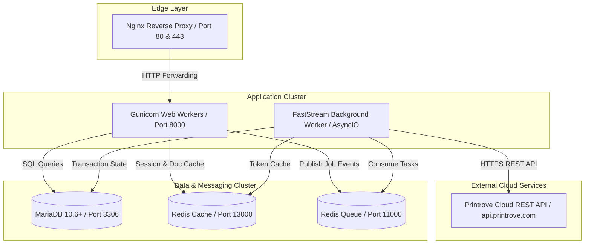
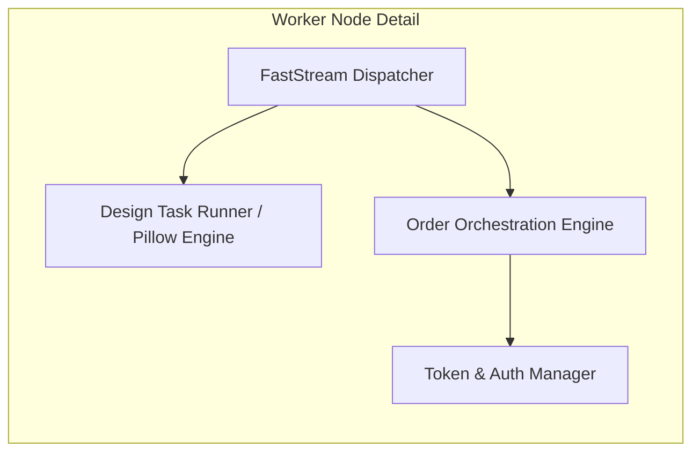

# Deployment View

## Infrastructure Level 1: Bench Deployment Topology

The `frappe_printrove` application is deployed within a standard Frappe Bench multi-tenant or single-tenant containerized environment.

### Motivation
Decoupling the synchronous WSGI application layer (Gunicorn) from the asynchronous FastStream background worker ensures that slow network interactions with Printrove or long-running image conversions never impact user-facing web request latency or checkout responsiveness.

### Quality and/or Performance Features
- **Zero Thread Exhaustion**: Asynchronous FastStream workers free execution slots during suspension (`frappe.wait_for`).
- **High Availability**: Web and worker tiers can scale horizontally independently.

### Mapping of Building Blocks to Infrastructure

| Building Block | Infrastructure Node | Runtime / Process | Exposed Port |
| :--- | :--- | :--- | :--- |
| Reverse Proxy | Edge Gateway Node | Nginx 1.24+ | 80, 443 |
| Web Application | App Server Instance | Gunicorn / Python 3.14 | 8000 |
| Background Orchestrator | Worker Container Instance | FastStream Worker Engine | N/A (Internal) |
| Relational Storage | Database Server | MariaDB 10.6+ InnoDB | 3306 |
| Cache & Queue Broker | In-Memory Data Store | Redis 7.x Server | 11000, 13000 |

---

## Infrastructure Level 2: Component Node Configuration

- **Environment Variables / site_config.json**:
  - `printrove_base_url`: Base URL for Printrove API (`https://api.printrove.com`).
  - `printrove_email`: Merchant account email identifier.
  - `printrove_password`: Merchant account password credential.
  - `printrove_supplier`: Supplier entity name linked in ERPNext (default `"Printrove"`).
  - `printrove_shipping_account`: Expense/Tax account head for shipping charges.
  - `printrove_credit_account`: Asset account head tracking prepaid wallet credits.
