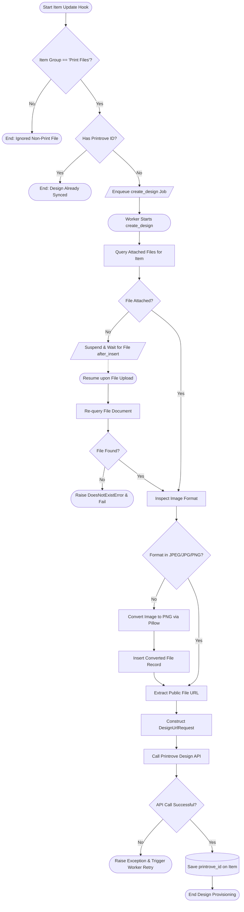

# Behavioral Workflows (BPMN): Design Provisioning

## 🎯 Primary Workflow: Artwork Design Provisioning Workflow

## 📝 Workflow Step Descriptions

1. **Start Item Update Hook**: Triggered by ERPNext whenever an `Item` document is created or updated.
2. **Check Item Group**: Verifies if the item belongs to the `"Print Files"` category. Non-artwork items are ignored.
3. **Check Existing Printrove ID**: Prevents redundant upstream API calls if the item already has a valid `printrove_id`.
4. **Enqueue Job**: Schedules `create_design` via `frappe.enqueue` with controller rate limits and retries.
5. **Query Attached Files**: Inspects `File` records attached to the current `Item`.
6. **Suspend & Wait for File**: If no file is attached, the job cleanly suspends execution using non-blocking event listening (`frappe.wait_for(event_key='after_insert', ...)`).
7. **Inspect Image Format**: Validates whether the image format conforms to Printrove's API requirements (JPEG, JPG, or PNG).
8. **Convert Image to PNG**: If formatted as WEBP, BMP, or TIFF, converts the image in-memory using Pillow and attaches the sanitized PNG.
9. **Construct DesignUrlRequest & Call API**: Assembles the Pydantic schema with an absolute HTTP/HTTPS URL and issues `POST /api/external/designs/url`.
10. **Save Printrove ID**: Stores the resulting design identifier on the `Item` record, satisfying downstream listeners.
