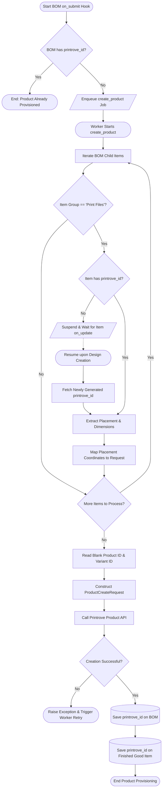

# Behavioral Workflows (BPMN): Product Provisioning

## 🎯 Primary Workflow: Custom SKU & Product Provisioning Workflow

## 📝 Workflow Step Descriptions

1. **Start BOM Hook**: Triggered by ERPNext whenever a Bill of Materials (`BOM`) is submitted (`on_submit`).
2. **Check Existing Product ID**: Prevents redundant SKU creations if the BOM already contains a `printrove_id`.
3. **Enqueue Job**: Enqueues `create_product` into the FastStream worker queue.
4. **Iterate BOM Items**: Iterates through BOM component line items looking for artwork records (`Item Group == 'Print Files'`).
5. **Check Design Availability**: Verifies whether the artwork item already has an active Printrove design identifier.
6. **Suspend & Wait for Design**: If the design is still being processed or uploaded, the worker suspends execution non-blockingly using `frappe.wait_for(event_key='on_update', filters={'doctype': 'Item', 'name': item_code})`.
7. **Extract Placement & Dimensions**: Reads custom fields (`print_placement`, `print_width`, `print_height`, `print_top`, `print_left`) and maps them into `PlacementDesign` structures.
8. **Construct ProductCreateRequest**: Combines blank garment attributes and artwork placement maps into a validated Pydantic model.
9. **Call Printrove Product API**: Issues HTTP `POST /api/external/products` via `PrintroveClient`.
10. **Save Product ID**: Stores the created custom product ID onto the `BOM` record and the parent finished good `Item` record.
