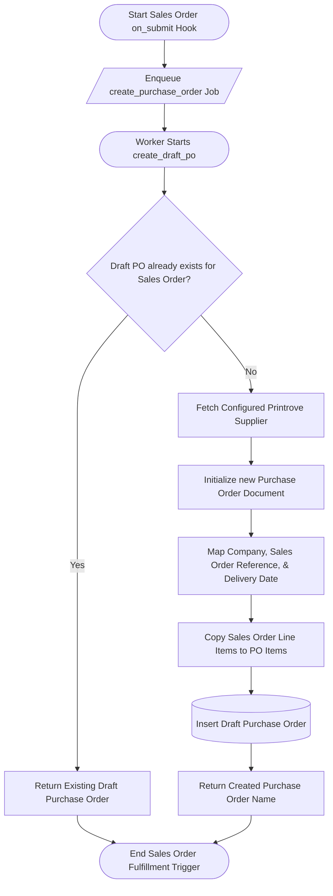

# Behavioral Workflows (BPMN): Sales Order Fulfillment Initiation

## 🎯 Primary Workflow: Sales Order to Purchase Order Conversion Workflow

## 📝 Workflow Step Descriptions

1. **Start Sales Order Hook**: Triggered by ERPNext whenever a retail `Sales Order` is submitted (`on_submit`).
2. **Enqueue Job**: Schedules `create_purchase_order` as a background task.
3. **Check Existing Draft PO**: Queries MariaDB for any existing unsubmitted (`docstatus == 0`) `Purchase Order` associated with this `Sales Order`.
4. **Fetch Supplier**: Retrieves the configured supplier name (defaults to `"Printrove"`) from `site_config.json` or `Printrove Settings`.
5. **Initialize Purchase Order**: Generates a new `Purchase Order` record in draft state (`docstatus = 0`).
6. **Map Data & Items**: Copies customer schedule dates, quantities, and item codes to create identical procurement lines.
7. **Insert PO**: Persists the draft `Purchase Order`, which will automatically trigger the downstream `Purchase Order` fulfillment pipeline.
