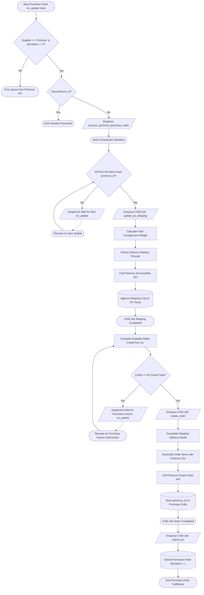

# Behavioral Workflows (BPMN): Purchase Order Fulfillment Orchestration

## 🎯 Primary Workflow: Purchase Order Drop-Ship Fulfillment Orchestrator

## 📝 Workflow Step Descriptions

1. **Start Purchase Order Hook**: Triggered by ERPNext on `Purchase Order` updates. Validates that the PO belongs to the Printrove supplier, is in draft state (`docstatus == 0`), and has no assigned `printrove_id`.
2. **Step 1 - Item Provisioning Synchronization**: The orchestrator verifies that all linked print file items have their corresponding upstream Printrove IDs generated. If any are missing, it suspends execution non-blockingly (`frappe.wait_for(event_key='on_update', filters={'doctype': 'Item', 'name': item_code})`).
3. **Step 2 - Shipping Rate Calculation**: Spawns child job `update_po_shipping`, which aggregates garment weights, extracts customer destination pincode, queries `GET /api/external/serviceability`, and updates the PO taxes table with exact courier freight rates.
4. **Step 3 - Wallet Credit Balance Verification**: Evaluates available wallet credit against the PO total. If credit is insufficient, the workflow suspends until a new `Purchase Invoice` is submitted to top up the balance (`frappe.wait_for(event_key='on_submit', filters={'doctype': 'Purchase Invoice', 'company': po.company, 'docstatus': 1})`).
5. **Step 4 - Printrove Order Placement**: Spawns child job `create_order` to format the delivery payload into `OrderCreateRequest` and issues `POST /api/external/orders`. It stores the returned `order_id` into `printrove_id`.
6. **Step 5 - Purchase Order Submission**: Spawns child job `submit_po` to transition the `Purchase Order` state from draft (`docstatus = 0`) to submitted (`docstatus = 1`), locking the procurement record and finalizing the fulfillment loop.
