# Behavioral Workflows (BPMN): Chart of Accounts and Purchase Invoice Wallet Recharge

## 🎯 Primary Workflow: Wallet Credit Accounting & Purchase Invoice Reconciliation Workflow

```mermaid
flowchart TD
    StartSetup([Start Account Configuration]) --> ConfigSettings[Configure Printrove Settings]
    ConfigSettings --> LinkAccounts[Map Shipping Account & Printrove Credit Account]
    LinkAccounts --> CreditCheckTrigger([Purchase Order Orchestrator Credit Check])

    CreditCheckTrigger --> QueryGLEntries[Query tabGL Entry for Credit Account]
    QueryGLEntries --> QueryUnbilledPOs[Query tabPurchase Order for Unbilled Supplier Total]
    QueryUnbilledPOs --> ComputeAvailableCredit[Compute Available Credit = GL Balance - Unbilled POs]
    
    ComputeAvailableCredit --> IsCreditSufficient{Available Credit >= PO Grand Total?}
    IsCreditSufficient -- Yes --> ContinueFulfillment([Proceed to Order Creation on Printrove])
    
    %% Suspension path
    IsCreditSufficient -- No --> SuspendOrchestrator[/Suspend Orchestrator & Wait for Purchase Invoice on_submit/]
    
    %% Finance Team Action
    SuspendOrchestrator -.-> FinanceNotice([Finance Team Notified of Low Credit])
    FinanceNotice --> CreatePayment[Create Payment Entry / Purchase Invoice for Supplier Printrove]
    CreatePayment --> SetAccountHead[Debit Printrove Wallet Credit Asset Account]
    SetAccountHead --> SubmitInvoice[Submit Purchase Invoice docstatus = 1]
    
    SubmitInvoice --> PostGLEntries[(Post GL Entries in MariaDB)]
    PostGLEntries --> EmitSubmitEvent[/Emit Purchase Invoice on_submit Event/]
    
    %% FastStream Match & Resumption
    EmitSubmitEvent --> MatchCondition{Matches Suspended Job Filters?}
    MatchCondition -- Yes --> ResumeOrchestrator([FastStream Worker Resumes Orchestrator])
    ResumeOrchestrator --> RequeryGL[Re-calculate Available Credit]
    RequeryGL --> CreditVerified{Credit Now Sufficient?}
    CreditVerified -- Yes --> ContinueFulfillment
    CreditVerified -- No --> SuspendOrchestrator
```

## 📝 Workflow Step Descriptions

1. **Start Account Configuration**: The system administrator or finance team configures the Chart of Accounts in `Printrove Settings`.
2. **Map Accounts**: Defines the asset account head (`printrove_credit_account`, e.g., `"Printrove Wallet Credit - Company"`) and the expense/tax head (`shipping_account`, e.g., `"Freight and Forwarding Charges - Company"`).
3. **Credit Check Trigger**: When a `Purchase Order` is being processed by [`process_printrove_purchase_order`](apps/frappe_printrove/frappe_printrove/jobs/order.py:141), the system calculates available credit.
4. **Compute Available Credit**: Reads `SUM(debit - credit)` from `tabGL Entry` for the credit account and subtracts unbilled amounts from open, submitted Purchase Orders.
5. **Suspend Orchestrator**: If available balance is less than the PO grand total, the FastStream worker suspends execution non-blockingly via `frappe.wait_for(event_key='on_submit', filters={'doctype': 'Purchase Invoice', 'company': po.company, 'docstatus': 1})`.
6. **Finance Recharge Action**: The finance department records a top-up transaction or advances payment to Printrove by submitting a `Purchase Invoice` or `Payment Entry`.
7. **Post GL Entries**: MariaDB commits general ledger entries debiting the Printrove Wallet Credit account and crediting the Bank/Cash account.
8. **FastStream Resumption**: `frappe-controller` catches the `Purchase Invoice on_submit` event, satisfies the deferred job's match condition, and resumes the orchestrator without re-executing already completed sub-tasks.
9. **Proceed to Fulfillment**: With credit restored, the workflow moves directly to `create_order` and dispatches the job to the Printrove API.
