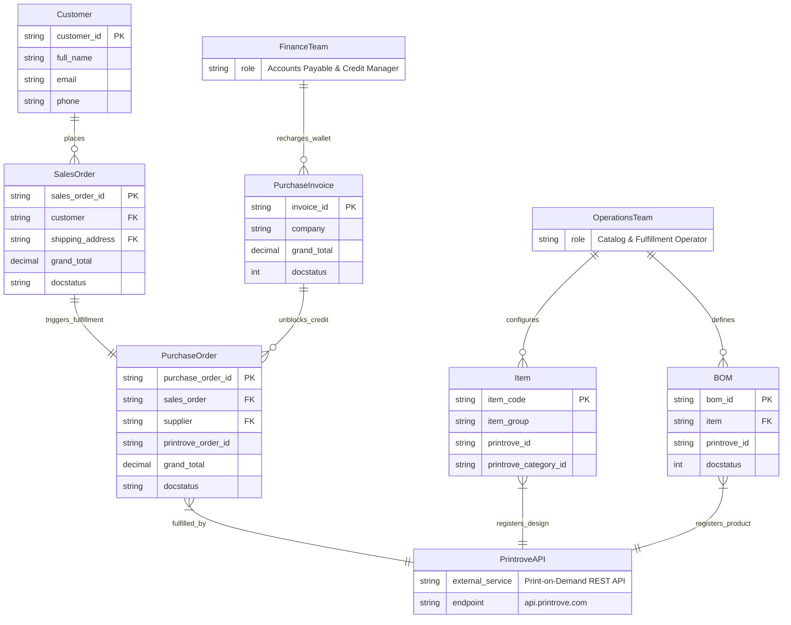

# C1: System Context Diagram

## 🎯 System Boundaries
This document defines the high-level system context, primary actors, and external system boundaries for the `frappe_printrove` application within the ERPNext ecosystem.

## 📊 Context ERD

## 📝 Entity Descriptions

- **Customer**: End-user placing retail orders resulting in Sales Order records.
- **OperationsTeam**: Merchandising and warehouse personnel managing Item catalog assets, print file attachments, and Bill of Materials (BOM) specifications.
- **FinanceTeam**: Accounting personnel maintaining the Printrove prepaid wallet credit balance through Purchase Invoices and GL entries.
- **SalesOrder**: ERPNext transactional order document capturing items and destination customer shipping address.
- **PurchaseOrder**: Automated downstream procurement record routing fulfilled items directly to supplier "Printrove".
- **Item**: Core ERPNext inventory entity representing designs (item group "Print Files") and finished print-on-demand goods.
- **BOM**: Bill of Materials aggregate combining blank apparel garments with artwork files and positional print coordinates.
- **PurchaseInvoice**: Accounting invoice reflecting cash recharges and supplier settlement to maintain positive available credit balance.
- **PrintroveAPI**: External print-on-demand fulfillment gateway providing design upload, SKU mapping, courier serviceability checks, and drop-ship order placement.
