# C2: Container Diagram

## 🎯 Container Architecture
This document defines the runnable runtime services, databases, asynchronous event queues, background workers, and external third-party HTTP integrations comprising the `frappe_printrove` deployment architecture.

## 📊 Container ERD

```mermaid
erDiagram
    Nginx ||--|| Gunicorn : "HTTP / Reverse Proxy"
    Gunicorn ||--|| MariaDB : "SQL / MariaDB 10.6+"
    Gunicorn ||--|| RedisCache : "TCP / In-Memory Cache"
    Gunicorn ||--o{ RedisQueue : "Pushes Event Tasks"
    FastStreamWorker }|--|| RedisQueue : "Pops Background Tasks"
    FastStreamWorker ||--|| MariaDB : "Reads / Updates DocTypes"
    FastStreamWorker ||--|| RedisCache : "Caches Access Tokens"
    FastStreamWorker }|--|| PrintroveAuthAPI : "POST /api/external/token"
    FastStreamWorker }|--|| PrintroveDesignAPI : "POST /api/external/designs/url"
    FastStreamWorker }|--|| PrintroveProductAPI : "POST /api/external/products"
    FastStreamWorker }|--|| PrintroveServiceabilityAPI : "GET /api/external/serviceability"
    FastStreamWorker }|--|| PrintroveOrderAPI : "POST /api/external/orders"

    Nginx {
        string role "Web Reverse Proxy & TLS Termination"
        string port "80 / 443"
    }

    Gunicorn {
        string runtime "Python 3.14 / Frappe WSGI Server"
        string port "8000"
    }

    FastStreamWorker {
        string runner "FastStream / frappe-controller worker"
        string engine "AsyncIO Task Engine"
    }

    MariaDB {
        string engine "MariaDB 10.6+ / Percona Server"
        string port "3306"
    }

    RedisCache {
        string engine "Redis 7.x Cache"
        string port "13000"
    }

    RedisQueue {
        string engine "Redis 7.x Queue / PubSub"
        string port "11000"
    }

    PrintroveAuthAPI {
        string endpoint "api.printrove.com/api/external/token"
        string protocol "HTTPS / JSON"
    }

    PrintroveDesignAPI {
        string endpoint "api.printrove.com/api/external/designs/url"
        string protocol "HTTPS / JSON"
    }

    PrintroveProductAPI {
        string endpoint "api.printrove.com/api/external/products"
        string protocol "HTTPS / JSON"
    }

    PrintroveServiceabilityAPI {
        string endpoint "api.printrove.com/api/external/serviceability"
        string protocol "HTTPS / Query Params"
    }

    PrintroveOrderAPI {
        string endpoint "api.printrove.com/api/external/orders"
        string protocol "HTTPS / JSON"
    }
```

## 📝 Container Descriptions

- **Nginx**: Edge web server handling static asset delivery, SSL/TLS termination, and HTTP request routing to the Gunicorn application server.
- **Gunicorn**: Frappe Framework WSGI application server executing synchronous web requests, doc hooks, and API endpoints.
- **FastStreamWorker**: Distributed asynchronous background worker powered by `frappe-controller` and `FastStream`, managing rate limiting, retries, suspend/resume replay semantics, and external HTTP orchestration.
- **MariaDB**: Relational transactional database storing core DocTypes (`Item`, `BOM`, `Sales Order`, `Purchase Order`, `Purchase Invoice`, `Printrove Settings`, `File`).
- **RedisCache**: In-memory key-value store used by Frappe for query caching and `PrintroveClient` bearer access token caching (`printrove_access_token:{email}`).
- **RedisQueue**: Message broker and event queue transport backing `frappe-controller` FastStream job queues.
- **PrintroveAuthAPI**: Printrove authentication gateway providing temporary bearer access tokens.
- **PrintroveDesignAPI**: Printrove image ingestion endpoint downloading uploaded artwork directly via publicly accessible presigned URLs.
- **PrintroveProductAPI**: Printrove SKU generation endpoint binding blank products, garment variants, and print placement dimensions.
- **PrintroveServiceabilityAPI**: Printrove courier and pincode verification API calculating real-time freight charges and delivery feasibility.
- **PrintroveOrderAPI**: Printrove purchase order placement endpoint initiating on-demand manufacturing and dropshipping.
